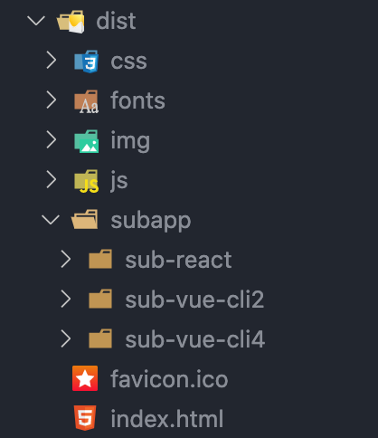
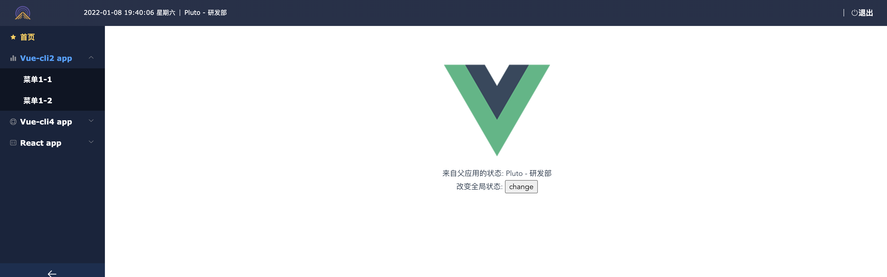
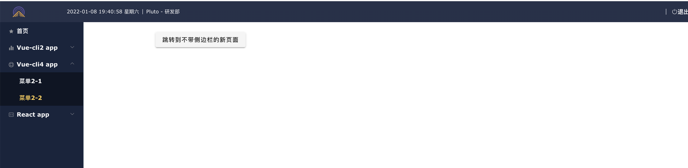
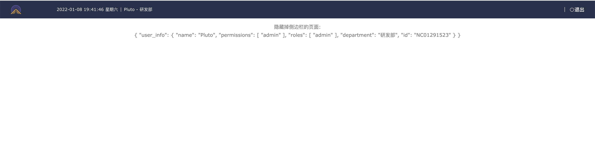
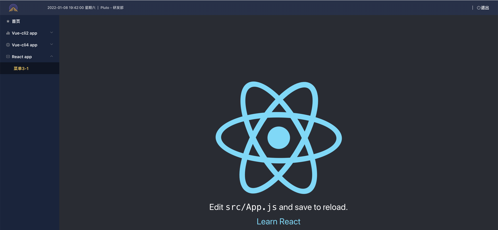

# qiankun-admin-example

**qiankun微前端demo，包含基于vue-cli2 和 vue-cli4创建的应用 和 react应用。**

[在线预览](https://qiankun-admin-example.surge.sh/)

`npm install` 安装主子应用所有依赖

`npm start` 启动所有应用

`npm run build` 构建所有应用,最终构建到最外层的dist目录:

```
 App running at:
  - Local:   http://localhost:2750/ 
  - Network: http://10.10.128.110:2750/
```



# 应用截图









